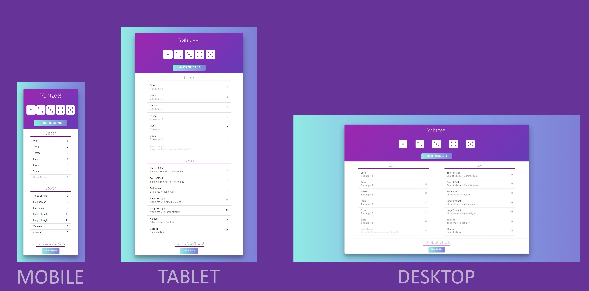

# Yahtzee Game built with React

## About Yahtzee Game

 [Yahtzee](https://en.wikipedia.org/wiki/Yahtzee) is a dice game.  The objective of the game is to score points by rolling five dice to make certain combinations.  The dice can be rolled up to three times in a turn to try to make various scoring combinations and dice must remain in the box.  A game consists of thirteen rounds. After each round the player chooses which scoring category is to be used for that round.  Once a category has been used in the game, it cannot be used again. The scoring categories have varying point values, some of  which are fixed values and others for which the score depends on the value of the dice. A Yahtzee is five-of-a-kind and scores  50 points, the highest of any category. The winner is the player who scores the most points.

## Screenshot

## How to play the Game?

You have two options to play the game:

1. Use [this link](https://emadal-quhaim.github.io/yahtzee-react/) to the game on emadal-quhaim.github.io OR

2. By cloning this project:
    - Clone the project: `git clone https://github.com/EmadAl-Quhaim/yahtzee-react.git`;
    - Go to the project folder: `cd yahtzee-react`;
    - Download the dependencies: `npm install`;
    - Start the application: `npm start`.
    - It will open a browser page (if it doesn't, go to [http://localhost:3000](http://localhost:3000/)).

Then you can start playing. Good luck!

## Built with

- ReactJS
- MaterialUI

## Acknowledgement

- The User Interface is inspired by the project [react-yahtzee-game](https://github.com/kens-visuals/react-yahtzee-game) by [@kens-visuals](https://github.com/kens-visuals).
